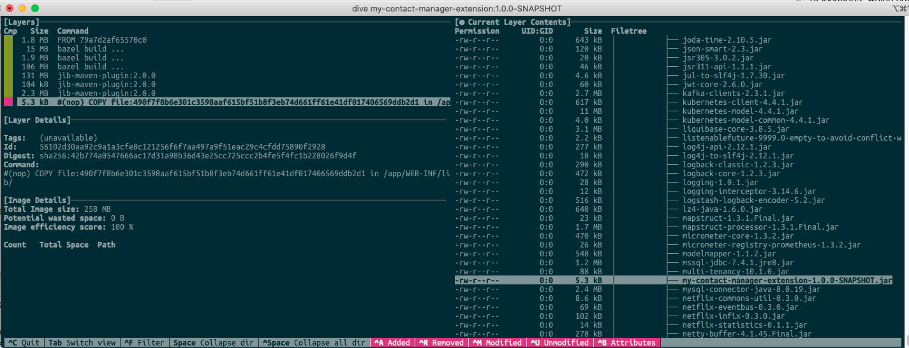

# contact-manager extension

[Example Contact Manager Behaviour extensions from Community](https://community.backbase.com/documentation/DBS/latest/contacts_extend_behavior)

## Description
This example shows you how to modify the default behavior of the Contacts presentation service. 
This modification checks for specific country values and raises a flag if, for example, a country is on a blacklist.

## How to use
To use your service extension, you include the JAR build from this artifact to the CLASSPATH used when 
the service is started.

[When you run a service as a bootable jar](https://docs.spring.io/spring-boot/docs/current/reference/htmlsingle/#executable-jar-property-launcher-features), 
you can use the `loader.path` command line argument to add JARs to the CLASSPATH. 
`loader.path` takes a comma-separated list of locations, which can reference JARs or 
directories containing one or more JARs. For example: 

    java -Dloader.path=/lib,/path/to/my.jar -jar myservice-boot.jar
    
If you are not running the Service as a war, use the mechanism available in your application server.

### Docker
As an example we include a [Dockerfile](Dockerfile) showing how we could extend our Backbase Docker images
with the Behaviour Extension jar we just created.

    mvn package -Pdocker

After the build finishes we will have a Docker image with our extension included inside and ready to use.

